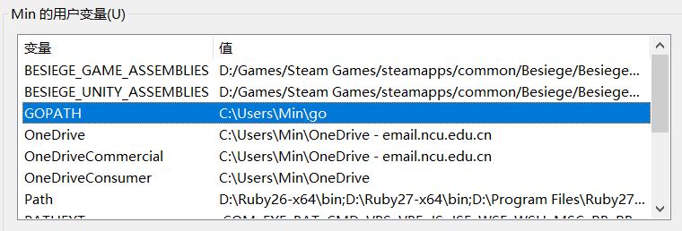

<!--more-->

## 起步

### 配置GOPATH

go项目的存放路径



默认创建了= =

如果更改，PATH里`.../go/bin`也对应修改

### 项目

程序以package为单位，以`package main`中的`func main()`为入口

## 语法

### 导入

```go
import (
	"fmt"
	"math"
)
```

```go
import f "fmt"
func main() {
	f.Println(add(42, 13)) //重命名标识符
}
```


### 函数

```go
func add(x int, y int) int {
	return x + y
}
```

```go
func add(x, y int) int { //省略连续的相同类型
	return x + y
}
```

```go
func swap(x, y string) (string, string) { //多值返回
	return y, x
}
```

```go
func split(sum int) (x, y int) { //相当于提前定义了要返回的值的名称
	x = sum * 4 / 9
	y = sum - x
	return //不带命名的return语句 将会直接返回上面定义了名称的返回值
}
```

### 变量

```go
var a, b, c bool //声明了三个bool类型的变量
//声明可以出现在任何位置
func main() {
	var i int //声明的变量具有默认值
	fmt.Println(i, a, b, c)
}
```

```go
var i, j int = 1, 2 //声明变量的同时初始化

func main() {
	var a b, c = true, false, "no!" //变量可以从初始化中获得类型
	fmt.Println(i, j, a, b, c)
}
```

```c++
k := 3 //简洁赋值语句 代替var
//函数外的每个语句都必须以关键字开始（var, func 等等），因此 := 结构不能在函数外使用。
```

```go
func test(x int) int  {
	return x
}

func main() {
	x := 1.2
	fmt.Println(test(int(x))) //不同类型赋值需要显式转换
}
```

### 常量

```go
//与var相对的 声明常量使用关键字const
const Pi = 3.14
// 常量不能用 := 声明
```

### 循环、分支

```go
func main() {
	sum := 0
	for i := 0; i < 10; i++ {
		sum += i
	}
	fmt.Println(sum)
}
```

```go
func main() {
	sum := 1
	for sum < 1000 { //Golang中的while
		sum += sum
	}
	fmt.Println(sum)
}
```

```go
if x < 0 { //分支

} else {
    
}
```

```go
func pow(x, n, lim float64) float64 {
	if v := math.Pow(x, n); v < lim { //在分支判断的前面执行一个表达式
		return v
	}
	return lim
}
```

```go
func main() { //switch
	fmt.Print("Go runs on ")
	switch os := runtime.GOOS; os { //没什么好说的吧
	case "darwin":
		fmt.Println("OS X.")
        // break自动提供
	case "linux":
		fmt.Println("Linux.")
	default:
		fmt.Printf("%s.\n", os)
	}
}
```

```go
func main() { // if-else if-...-else
	t := time.Now()
	switch {
	case t.Hour() < 12:
		fmt.Println("Good morning!")
	case t.Hour() < 17:
		fmt.Println("Good afternoon.")
	default:
		fmt.Println("Good evening.")
	}
}
```

```go
//defer关键字

var s string

func getWorld() string {
	s = "world"
	return s
}

func main() {
	defer fmt.Println(getWorld()) //将函数推迟到本层函数执行完毕后执行，但是参数表达式会立即完成
	fmt.Printf("在上面那个函数真正调用之前，其参数表达式已经完成，即调用getWorld()过后，s=%s\n", s)
	fmt.Println("hello")
}
```

```go
func main() {
	fmt.Println("counting")

	for i := 0; i < 10; i++ {
		defer fmt.Println(i) //被defer的函数会被压入一个栈中，依次调用
	}

	fmt.Println("done")
}
```

### 指针

```go
var p *int

i := 42
p = &i

fmt.Println(*p) 
*p = 21         
```

### 结构体

```go
type Vertex struct {
	X int
	Y int
}

func main() {
	a := Vertex{1, 2}
	fmt.Println(a)
}
```

```go
func main() {
	p := &Vertex{1, 2} //声明并初始化一个结构体指针
	p.X = 1e9 //隐式(*p).X
	fmt.Println(v)
}
```

```go
v := Vertex{X: 1}  // 只显式地给部分值 Y:0 被隐式地赋予
```

### 数组

```go
var a [10]int //声明
primes := [6]int{2, 3, 5, 7, 11, 13} //声明并初始化
//类型不可省略
//显式初始化时数量可以省略 省略后是切片（实际上是创建一个数组，然后构建一个引用了它的切片）
//长度不可变
```

### 切片

```go
a[low : high] //前闭后开
```

```go
func main() {
	a := []int{1, 2, 3, 4}
	b := a[0: 2]
	c := a[2: 4]
	fmt.Println(b, c) //切片像是对数组的引用

	for i:=0; i<4; i++{a[i] = 0}
	fmt.Println(b, c) //原数组修改后切片的内容也会改动

	b[0] = -1
	c[0] = -1
	fmt.Println(a) //同样对切片的修改也会引发原数组内容的变化
}
```

```go
/*
切片拥有 长度 和 容量
	    len()   cap()
长度：切片所包含元素的个数
容量：他的第一个元素开始，到被引用的数组的最后一个元素的个数
**/
s := []int{2, 3, 5, 7, 11, 13} //创建一个对长度为6的数组的切片
s = s[:0] //截取切片使其长度为0 长度变化 容量不变
s = s[:4] //拓展其长度 长度变化 容量不变
s = s[2:] //舍弃前两个值 长度变化 容量变化

// 超出容量发生runtimeerro
```

```go
//a := make([]type, len, cap)  用make创建切片（动态数组）
b := make([]int, 0, 5) // len(b)=0, cap(b)=5
```

```go
board := [][]string{
    []string{"_", "_", "_"},
    []string{"_", "_", "_"},
    []string{"_", "_", "_"},
} //二维切片
```

```go
/*
向切片追加新元素
func append(s []T, vs ...T) []T
arg1: 被追加的切片
arg2: 追加进去的元素

当 s 的底层数组太小，不足以容纳所有给定的值时，它就会分配一个更大的数组。返回的切片会指向这个新分配的数组。
**/

func main() {
	var s []int
	printSlice(s)

	// 添加一个空切片
	s = append(s, 0)
	printSlice(s)

	// 这个切片会按需增长
	s = append(s, 1)
	printSlice(s)

	// 可以一次性添加多个元素
	s = append(s, 2, 3, 4)
	printSlice(s)
}
```

```go
//切片遍历
var pow = []int{1, 2, 4, 8, 16, 32, 64, 128}
// pow := []int{...}

func main() {
	for i, v := range pow { //rang pow返回两个值，第一个是下标，第二个数元素副本，不需要的用_代替
		fmt.Printf("2**%d = %d\n", i, v)
	}
}
```

### 映射

```go
//声明一个string到Type的映射
var m map[string]Type
//用make创建一个映射
m = make(map[string]Type)
//声明并初始化一个映射
type Vertex struct {
	Lat, Long float64
}
var m = map[string]Vertex{
	"Bell Labs": Vertex{
		40.68433, -74.39967,
	},
	"Google": Vertex{
		37.42202, -122.08408,
	},
}
//省略类型
var m = map[string]Vertex{
	"Bell Labs": {40.68433, -74.39967},
	"Google":    {37.42202, -122.08408},
}
```

```go
//增、改
m[key] = val
//查
elem = m[key]
//删
delete(m, key)
//检测键是否存在值
elem, ok = m[key]
```

### 函数变量化

函数可以作为变量、参数、返回值进行传递

### 函数的闭包

什么是闭包？存在自由变量的函数就是闭包。

自由变量与约束变量？

```go
func liner(a, b int) func(int) int {
    return func(x int){
        return x * a + b
    }
}
//对于被返回的闭包可以说 x 是受限制的约束变量，a b 是自由变量
//且这个闭包与自由变量a、b是绑定的
```

案例：斐波那契闭包

```go
// 返回一个“返回int的函数”
func fibonacci() func() int {
	x1, x2, i := 1, 1, 0
	return func() int {
		i++
		if i == 1 || i == 2{
			return 1
		}else {
			t := x2
			x2 += x1
			x1 = t
			return x2
		}
	}
}

func main() {
	f := fibonacci()
	for i := 0; i < 10; i++ {
		fmt.Println(f())
	}
}
```

### 方法（带接收者的函数）

接收者能够通过`.`调用这个函数

```go
type Rectangle struct {
	X, Y float64
}

func (v Rectangle) Area() float64 {
	return math.Sqrt(v.X*v.X + v.Y*v.Y)
}

func main() {
	v := Rectangle{3, 4}
	fmt.Println(v.Area())
}
```

接收者只能是同一个包内定义的类型

```go
func (f float64) Abs() float64 {
	if f < 0 {
		return float64(-f)
	}
	return float64(f)
}//×

type MyFloat float64 
func (f MyFloat) Abs() float64 {
	if f < 0 {
		return float64(-f)
	}
	return float64(f)
}//√
```

