[TOC]

# 并发

## 进程&线程

### 进程

* 程序由指令和数据组。指令加载至CPU，数据加载至内存，另外还可能需要用到其他设备如磁盘。进程即用来加载指令、管理内存、管理IO
* 程序被运行（从磁盘加载程序代码到内存），就开启一个进程
* 进程可以视为程序的一个实例，大部分程序可以同时运行多个进程（程序多开）

### 线程

* 一个进程之内可分一到多个线程
* 一个线程就是一个指令流，将指令流中的一条条指令顺序交给CPU执行
* java中，线程时最小调度单位，进程是最小资源分配单位。windows中进程不活动，作为线程的容器

### 对比

* 进程基本相互独立；线程存在与进程内，是其子集
* 进程拥有共享的资源，如内存空间等，供内部的线程共享
* 进程通信比较复杂
* 线程通信因为共享内存，比较简单
* 线程的上下文切换成本更低

### 并发

微观串行，进程轮流使用CPU，concurrent

### 并行

多核CPU，parallel

### 应用

* 同步，需要等待结果返回才能继续运行
* 异步，不需要等待就能继续运行

*tip：同步另有让多个线程步调一致的意思*

### 结论

1. 单核cpu下，多线程不能实际提高程序计算效率，只是为了能够在不同的任务之间切换，不同线程轮流使用cpu，不至于一个线程总占cpu，别的线程没法干活
2. 多核cpu可以并行跑多个线程，能否提高效率在于任务设计拆分，参考【阿姆达尔定律】
3. IO不占用cpu，但是线程等待IO称为【阻塞IO】。后有改进的【非阻塞IO】、【异步IO】

## Java线程

### 五种状态

创建、就绪、运行、阻塞、终止

### 六种状态（Thread.State）

`NEW` `RUNNABLE` `BLOCKED` `WAITING` `TIMED_WAITING` `TERMINATED`

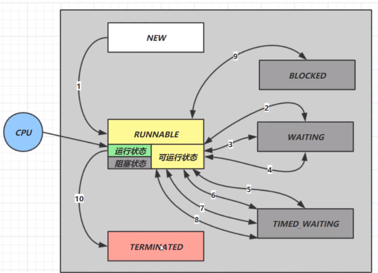

1. `start`
2. `wait` /  `notify` `interrupt` 
3. `join`
4. `park` /  `unpark`
5. `wait(n)`
6. `join(n)`
7. `sleep(n)`
8. `parkNannos(n) parkUntil(n)`
9. 竞争锁失败

### 创建和运行线程

#### 方法一 直接使用Thread

```java
Thread t = new Thread() {
	public void run() {
		// some things
	}
};
t.start();
```

#### 方法二 使用Runnable配合Thread

```java
Runnable runnable = () -> {...};
Thread t = new Thread(runnable);
t.start();
```

线程与任务分离；更容易与线程池等API配合；任务类脱离Thread继承体系，更灵活

#### 方法三 FutureTask配合Thread

FutureTask接收Callable类型参数，处理有返回结果的情况

```java
FutureTask<Integer> task = new FutureTask<>(() -> {
    log.info("Future Task running...");
    Thread.sleep(1000);
    return 100;
});

Thread t = new Thread(task, "t1");

task.get(); 
```

### 查看进程线程的方法

#### windows

* 任务管理器可以查看进程和线程数
* `tasklist` `taskkill`

#### Linux

* `ps -fe`查看所有进程
* `ps -fT -p <PID>`查看某个进程的所有线程
* `kill` 关闭进程
* `top`按大写H切换是否显示线程
* `top -H -p <PID>`查看某个进程的所有线程

Java

* `jps`查看所有java进程
* `jstask <PID>`查看某个java进程的所有线程状态
* `jconsle`查看某个Java进程中线程的运行情况

### 线程运行原理

#### 栈&栈帧

JVM由堆、栈、方法区组成；线程使用栈

* 栈有多个栈帧，对应着每次方法调用时所使用的内存
* 每个线程只能有一个活动栈帧，对应正在执行的方法

多线程时，各线程的栈帧独立

#### 上下文切换

因为一下一些原因CPU不再运行当前线程，转而执行另一个线程的代码：

* 线程时间片到
* 垃圾回收
* 有更高级的线程需要运行
* 线程自己调用了sleep、yield、wait、park、synchronized、lock等方法

当上下文切换发生时，由操作系统保存当前线程的状态，并恢复另一个线程的状态。java中程序计数器完成这个操作，记住下一条jvm指令的执行地址，等

频繁的上下文切换会影响性能

### 常见线程方法

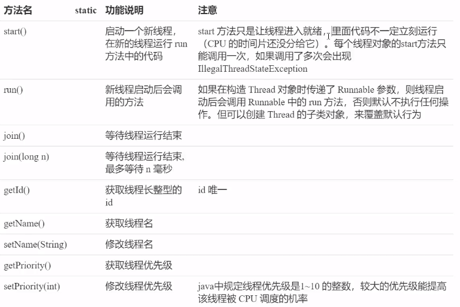

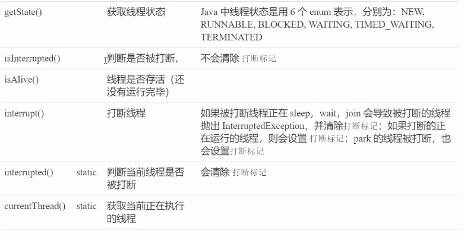

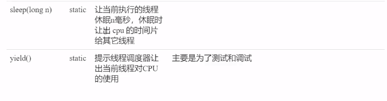

### `start` & `run`

直接调用Thread对象的run方法，不会开启新的线程，而是在当前线程执行

### `sleep` & `yield`

#### **sleep**

* 线程会从Running进入Timed Waiting状态（阻塞）
* 线程睡眠中可被调用interrupt打断，抛出InterruptException
* 睡眠结束的线程未必立刻得到执行
* 建议使用`TimeUnit.sleep()`代替`Thread.sleep()`，可读性好点

#### **yield**

* 调用yield的线程会让出当前CPU，从Running进入Runnable（就绪）

#### **线程优先级**

* 线程优先级提示（hint）调度器优先调度该线程，具体由调度器决定
* 如果cpu忙，较高优先级线程可能获得更多时间片；如果闲，优先级没啥用

#### *案例：防止CPU100%*

##### sleep实现

在没有利用cpu来计算时，不要让while(1)空转浪费cpu，这是可以用yield或sleep来让出cpu的使用权给其他程序

```java
//在while(1)中
sleep(50); //一个较短的时间，仅是为了让出cpu防止空转
```

适用于无需锁同步的场景

### `jion`方法

考虑如下情况，r无法获得更新后的值

```java
static int r = 0;
public static void main(String[] args) throws InterruptedException {
    test();
}
private static void test() throws InterruptedException {
    Thread t1 = new Thread(() -> {
        sleep(1);
        r = 10;
    }, "t1");
    t1.start();
    log.info("r: {}", r);
}
```

```java
t1.start();
t1.jion();
log.info("r: {}", r);
```

主线程进行到jion时阻塞，等待t1线程执行完毕

### `interrupt`方法

打断阻塞状态（sleep、wait、join），打断后打断标记其实是false

打断正常运行线程，线程不会直接停止，打断标记会变成true

#### 两阶段终止模式 （Two Phase Termination）

`stop()`直接杀死线程，如果线程拿了锁，就没机会释放

样例：一个可中止的系统状态监控程序

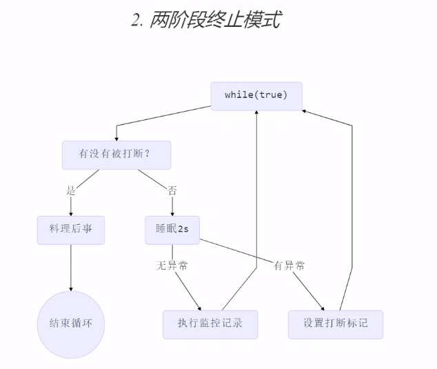

#### 打断park线程

`LockSupport.park()`

打断parking线程，打断标记变为true；当打断标记已为true时，调用park将不会再停止

`Tread.interrupted()` 返回当前打断标记，然后将其置为false

### 主线程与守护线程

默认情况下，Java进程需要的等待所有线程运行结束才会结束。有一种特殊的线程叫守护线程，只要其他非守护线程全部结束，即使守护线程仍在进行，也会强制结束

```java
public static void main(String[] args) throws InterruptedException {
    Thread t1 = new Thread(() -> {
        while (true) {
            if (Thread.currentThread().isInterrupted()) {
                break;
            }
        }
        log.info("t1 结束");
    }, "t1");
    
    t1.setDaemon(true);
    t1.start();

    TimeUnit.SECONDS.sleep(1);
    log.info("main 结束");
}
```

GC是守护线程

守护线程的守护含义是？

## 共享模型-管程

### 多线程下使用共享变量的问题

如果对共享变量的读写不具有原子性，一个线程的结果可能因为线程切换没来得及写入（指令交错），当再切换回时进行的写入会覆盖其他线程的原子操作

对共享资源的多线程读写操作代码块，称为**临界区**

多个线程在临界区内执行，由于代码的**执行顺序不同**而导致结果无法预测，称之为发生了**竞态条件**

### 避免临界区的竞态条件发生

* 阻塞式：synchronized，Lock
* 非阻塞式：原子变量

### synchronized-互斥

即对象锁

语法

```java
synchronized(obj){
    // 临界区
}
```

```java
synchronized void fun(){...}
//等价于
void fun(){
    synchronized(this){...}
}

synchronized static void fun(){...}
//等价于
static void fun(){
    synchronized(Clazz.class){...}
}
```

### 变量的线程安全分析

#### 成员变量和静态变量

*  没有共享，线程安全
* 读共享，线程安全
* 读写共享，需要考虑

#### 局部变量

* 局部变量线程安全
* 局部变量引用的对象
  * 该对象没有逃离方法的作用范围，线程安全
  * 该对象逃离方法的作用范围，需要考虑

局部变量

```java
public static void test(){
	int i = 10;
	i++;
}
```

局部变量在栈帧中各自创建，不存在共享

局部变量引用

```java
public class TestThreadUnsafe {
    public static void main(String[] args) {
        ThreadUnsafe test = new ThreadUnsafe();

        new Thread(test::fun, "Thread-1").start();
        new Thread(test::fun, "Thread-2").start();
    }
}

class ThreadUnsafe{
    List<Object> list = new ArrayList<>();

    public void fun(){
        for (int i=0; i<1000; i++){
            add();
            remove();
        }
    }

    private void add() {
        list.add(new Object());
    }

    private void remove() {
        list.remove(0);
    }
}
```

两个线程引用了同一个对象，增减操作不具备原子性，线程不安全

### 常见线程安全类

`String`、`Integer`、`StringBuffer`、`Random`、`Vector`、`HashTable`、`java.util.concurrent`

具体指，当多个线程调用这些类的一个实例时，是线程安全的，即方法具有原子性

但，多个方法的组合不是原子性的，如`if(table.get("key") == null) {table.put("key", "value")}`

`String`、`Integer`等不可变类，在修改时实际返回的是新对象的引用

不可变类的修饰通常为`final`就是为了防止被继承破坏不可变的特性

### Monitor概念

#### Java对象头

普通对象

```ruby
Object Header (64btis)
Mark Word (32bits) | klass Word (32bits)
```

数组对象

```ruby
Object Header (64btis)
Mark Word (32bits) | Klass Word (32bits) | Array Length (32bits)
```

Mark Word结构

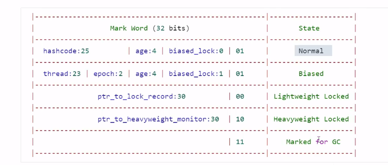

*tip：每一行代表MarkWord所处的一种状态*

#### Monitor（锁）

监视器 or 管程

每个Java对象都可以关联一个Monitor对象，如果使用`synchronized`给对象上锁（重量级）之后，该对象头的`Mark Word`中就被设置指向`Monitor`对象的指针（进入重量级锁状态）

Monitor结构如图

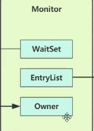

线程执行到临界区时，通过上锁对象去发现其指向的Monitor

* 初始Monitor的Owner为null
* 线程1进入临界区，将Owner值为线程1
* 线程2、线程3进入临界区，进入EntryList指向队列，进入BLOCKED状态
* 线程1执行完临界区，让出Owner，Monitor通知EntryList，阻塞进程自行竞争
* WaitSet中存放获得过锁，但资源条件不满足而进入WAITING状态到的线程

### synchronized优化

#### 轻量级锁

当线程对共享资源的使用时间往往错开，竞争较小时，Monitor的资源开销显得较大。这时使用轻量级锁；

如果轻量级锁使用过程中发生了竞争，则升级为重量级锁

* 线程对一个对象获得锁
* 在栈中创建一个锁记录，包含锁记录地址、对象引用
* 加锁
  * 获得锁成功，锁记录地址与对象头MarkWord交换
  * 获得锁失败。1. 说明其他进程获得过该对象轻量级锁，进入锁膨胀过程；2. 线程自身获得过一次该对象轻量锁，再添加一条锁记录作为重入计数
* 解锁
  * 解重入，去掉锁记录
  * 解轻量，MarkWord恢复给对象头
  * 失败，说明发生了锁膨胀，已经升级为重量级锁，转重量级锁解锁流程

发生锁膨胀时MarkWord记录在哪？

#### 锁膨胀

* 当线程1进行加轻量时，线程0已经加好了轻量
* 进入锁膨胀
  * 为对象申请Monitor锁，对象头MarkWord指向Monitor地址
  * 线程1进入Monitor的EntryList，进入BLOCKED状态
  * 此时Owner是？如果此时第三个线程进入，它根据什么判断对象是否已加锁？
* 线程0解轻量失败。按地址找到Monitor，设置Owner为null，唤醒EntryList
* MarkWord信息呢？

#### 偏向锁

持轻量锁线程每次进入临界区都需要做一次检查锁对象头，加一个锁记录，浪费性能。

当共享资源基本只有一个线程在使用，可以对其加偏向锁。

如果此时发生竞争，升级为轻量级锁

具体优化：第一次持锁将线程ID写入对象头MarkWord，后续发现ID是自己的就表示没有竞争

一个对象创建时：

* 如果开启了偏向锁（默认），markword后三位为101，thread、epoch、age为0
* 偏向锁默认是延迟的，不会在程序启动时立即生效，可使用VM参数 `-XX:BiasedLockingStartupDelay=0`禁用延迟
* 如果没有开启偏向锁，对象创建后，markword后三位为001，hashcode、age都为0，第一次用到hashcode时才会对其赋值

延迟的意义是什么？

禁用偏向锁 `-XX:-UseBiasedLocking`

可偏向的对象调用hashcode后，为了留出位置给hashcode，该对象的偏向会被禁用

已经加偏向锁的对象调用hashcode会发生什么？*偏向锁转为重量锁？*

调用wait/notify也会导致升级为重量级锁

#### 自旋优化（多核CPU）

线程发现对象已锁，尝试做几次空循环，如果持锁线程退出临界区， 释放了锁，当前线程就可以避免进入阻塞态

#### 批量重偏向

由于一个线程的加锁，导致撤销偏向锁的数量达到20阈值，对于余下偏向锁不升级，转而更为该线程的偏向锁

例：现有30个对象，偏向锁偏于线程1；线程1全部解锁后，线程2一次对这些对象加锁；前20个对象，偏向锁撤销，改为不可偏向状态；后10个对象，转偏向于线程2。

#### 撤销批量重偏向

一个类下的对象实例，偏向撤销的次数超过40次，后续该类产生的新对象皆为不可偏向

#### 锁消除

*JIT 即时编译器 优化热点代码*

如果发现一个锁对象不可能逃离方法、不可能被共享（逃逸分析），即消除synchronized代码

### wait / notify

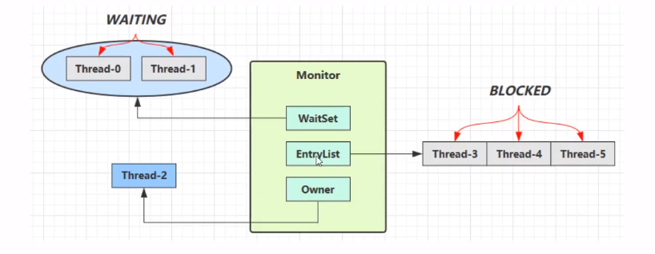

* Owner线程发现条件不满足，调用wait方法，进入WaitSet变为WAITING状态
* BLOCKED和WAITING的线程都处于阻塞状态，不占用CPU时间
* BLOCKED线程会在Owner线程释放锁时唤醒
* WAITING线程会在Owner线程调用notify或notifyAll时唤醒
* 被唤醒的线程重新竞争

#### API介绍

调用这些方法的前提是，线程已经获得了这个obj锁（结合synchronized）

* `obj.wait()`让owner到WaitSet中等待
* `obj.notify()`，monitor从waitSet中随机挑一个唤醒
* `obj.notifyAll()`monitor唤醒所有waitSet中线程

#### sleep & wait 区别 

* `sleep`是Thread方法，`wait`是Object方法
* `sleep`不需要强制和`synchronized`配合使用，但`wait`需要和`synchronized`一起使用
* `sleep`不会释放对象锁，`wait`会

#### 虚假唤醒

有多个线程使用wait等待不同的资源，其中一个资源准备好后使用notify却唤醒了错误的线程，称为虚假唤醒。

线程中使用while循环等待资源的语句，以防止虚假唤醒

```java
synchronized(lock){
    while(条件不成立){
    	lock.wait()
	}
    // 条件成立，干活
}

// 另一个线程，资源准备
synchronized(lock){
    lock.notifyAll();
}
```

### 同步模式-保护性暂停（Guarded Suspension）

用在一个线程等待另一个线程的执行结果

* 有一个结果需要从一个线程传递到另一个线程，让他们关联同一个GuardedObject
* 如果有结果不断从一个线程到另一个线程那么可以使用消息队列（生产者/消费者）
* JDK中，jion的实现、Future的实现，均采用这种模式
* 因为要等待另一方的结果，因此归类到同步模式

```ruby
Thread-1 ---> wait ---> GuardedObject <--- write <--- Thead-2
```

```java
class GuardedObject {
    private Object response;

    public Object getResponse() throws InterruptedException {
        return getResponse(0);
    }

    public synchronized Object getResponse(long timeout) throws InterruptedException {
        if (timeout < 0) {
            throw new IllegalArgumentException();
        }

        if (timeout != 0) {
            // 等待开始时间
            long begin = System.currentTimeMillis();
            long passed = 0;

            // 没有结果
            while (response == null) {
                long waitTime = timeout - passed;
                if (waitTime <= 0) {
                    // 等待超时
                    break;
                }

                this.wait(waitTime); // 避免虚假唤醒时，再次等待的时时间变长
                // 经历时间
                passed = System.currentTimeMillis() - begin;
            }
        } else {
            while (response == null) {
                this.wait();
            }
        }

        return response;

    }

    public void setResponse(Object response) {
        synchronized (this) {
            // 产生结果
            this.response = response;
            this.notifyAll();
        }
    }
}
```

```java
// 解耦内容产生者和内容消费者
class GuardedObjectHandler {
    private static Map<Integer, GuardedObjectV2> boxes = new ConcurrentHashMap<>();

    private static int id = 1;

    private static synchronized int generateId() {
        return id++;
    }

    public static GuardedObjectV2 newBox() {
        GuardedObjectV2 guardedObjectV2 = new GuardedObjectV2(generateId());
        boxes.put(guardedObjectV2.getId(), guardedObjectV2);
        return guardedObjectV2;
    }

    public static GuardedObjectV2 getBox(int id){
        return boxes.remove(id);
    }

    public static Set<Integer> ids(){
        return boxes.keySet();
    }
}
```

### 异步模式-生产者/消费者

* 与保护性暂停中的GuardedObject不同，不需要产生结果和消费结果的线程一一对应
* 消费队列可以用来平衡生产和消费的线程资源
* 生产者仅负责产生结果数据，不关心数据该如何处理，而消费者专心处理结果数据
* 消息队列是有容量限制的，满时不再加入，空时不再消耗
* JDK中各种阻塞队列，采用的这种模式

*异步：数据不会被立刻消费*

```java
class MessageQueue{
    private final LinkedList<Message> queue = new LinkedList<>();
    private final int capacity;

    public MessageQueue(int capacity) {
        this.capacity = capacity;
    }

    public Message get() throws InterruptedException {
        synchronized (queue){
            while(queue.isEmpty()){
                queue.wait();
            }
            Message message = queue.removeFirst();
            queue.notifyAll();
            return message;
        }
    }

    public void put(Message message) throws InterruptedException {
        synchronized (queue){
            while(queue.size() == capacity){
                queue.wait();
            }
            queue.addLast(message);
            queue.notifyAll();
        }
    }

}

@Data
class Message{
    private int id;
    private Object value;
}

```

### park & unpark

#### 使用

```java
//暂停当前线程
LockSupport.park();

// 恢复某个线程的运行
LockSupport.unpark(已暂停的线程对象);
```

park & unpark **以线程为单位**来阻塞和唤醒线程

如果unpark在park前就被调用，则park不会暂停当前的线程

#### 原理

每个Thead都会关联一个Parker对象

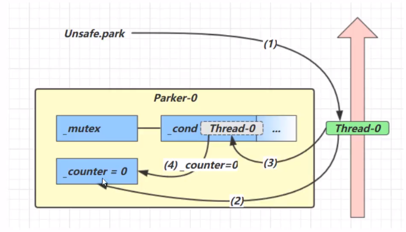

1. 当前线程调用park方法
2. 检查counter，为0，获得mutex互斥锁
3. 线程进入cond条件变量阻塞
4. 设置counter=0

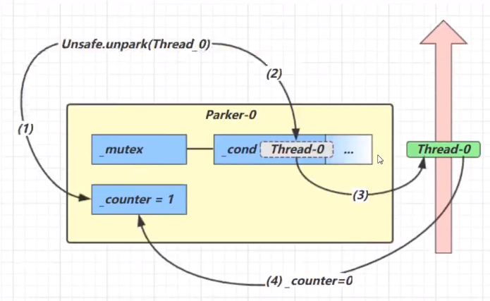

1. 当前线程调用unpark，设置conter为1
2. 唤醒cond条件变量的Thread-0
3. Thread-0恢复运行
4. 设置counter为0

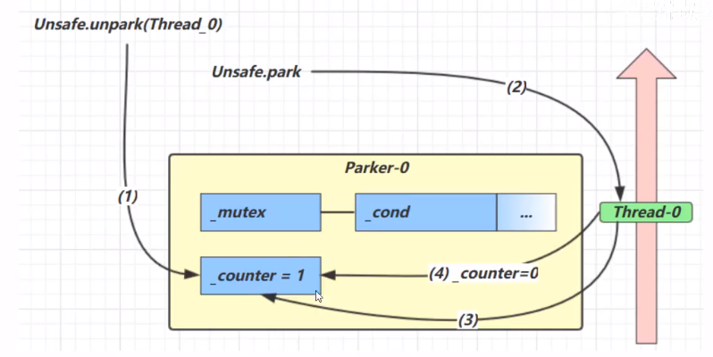

1. 调用unpark，设置counter=1
2. 调用park
3. 检查counter发现为1，继续运行
4. 设置counter为0

### 锁粒度

#### 提出

一个类拥有多个功能，多个线程调用类对象不同的功能，且都对该对象上锁，那么相当于串行，并发效率低

#### 解决

为无关联功能准备单独的锁对象

### 活跃性

#### 死锁

* 互斥：每个资源每次只能被一个线程使用
* 请求与保持：线程因请求资源而阻塞时，对已获得的资源保持不放
* 不剥夺：线程获得的资源在未使用完毕前不被强行剥夺
* 循环等待：若干线程之间形成循环等待资源

#### 活锁

线程没有被阻塞，但是由于某个状态没有达到，而不断运行的过程

比如一个线程++，一个线程--

通常的做法是在线程中增加随机睡眠时间

#### 饥饿

一个线程始终得不到CPU调度执行，就不能结束

*tip：在使用顺序加锁解决死锁的方法中，容易产生饥饿*

### ReentrantLock - 可重入锁

相比synchronized

* 可中断
* 可以设置超时时间
* 可以设置为公平锁
*  支持多个条件变量（等待不同资源进入不同的entrySet？）

与synchronized一样支持可重入

#### 语法

```java
try {
    // 获得锁
	reentrantLock.lock();
    // 临界区
} finally {
    // 释放锁
    reentrantLock.unlock();
}
```

#### 可重入

对于不可重入锁，即使是获得锁的线程，第二次进入锁时会被自己拦住

#### `lockInterruptibly()` - 可打断锁

竞争锁失败在等待时，可被调用`interrupt()`结束等待状态，进入catch句块

#### `tryLock()` - 可超时锁

不带参数，立刻返回获取结果

带参数，等待一段时间返回获取结果

可打断

如何实现的一段时间内持续尝试获得锁？保护性暂停

#### 公平锁

默认为不公平锁，所有人竞争

公平锁，按照进入阻塞队列的顺序，先入先得

降低了并发度

#### 多个条件变量

synchronized中也有条件变量，即waitSet，调用wait()进入waitSet等待

创建 `Condition condition = lock.newCondition();`

进入等待 `condition.await(); //前提是拥有锁`

通知唤醒 `condition.signal(); //signalAll()`

唤醒后重新参与竞争锁